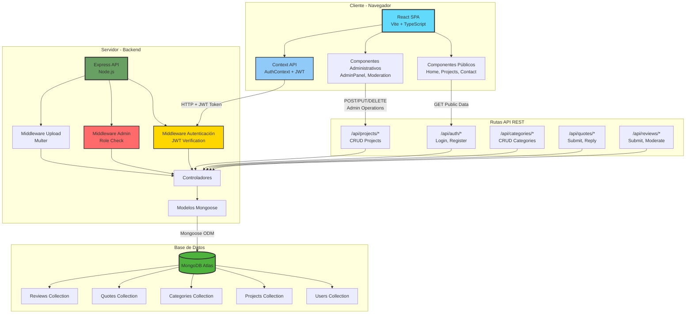
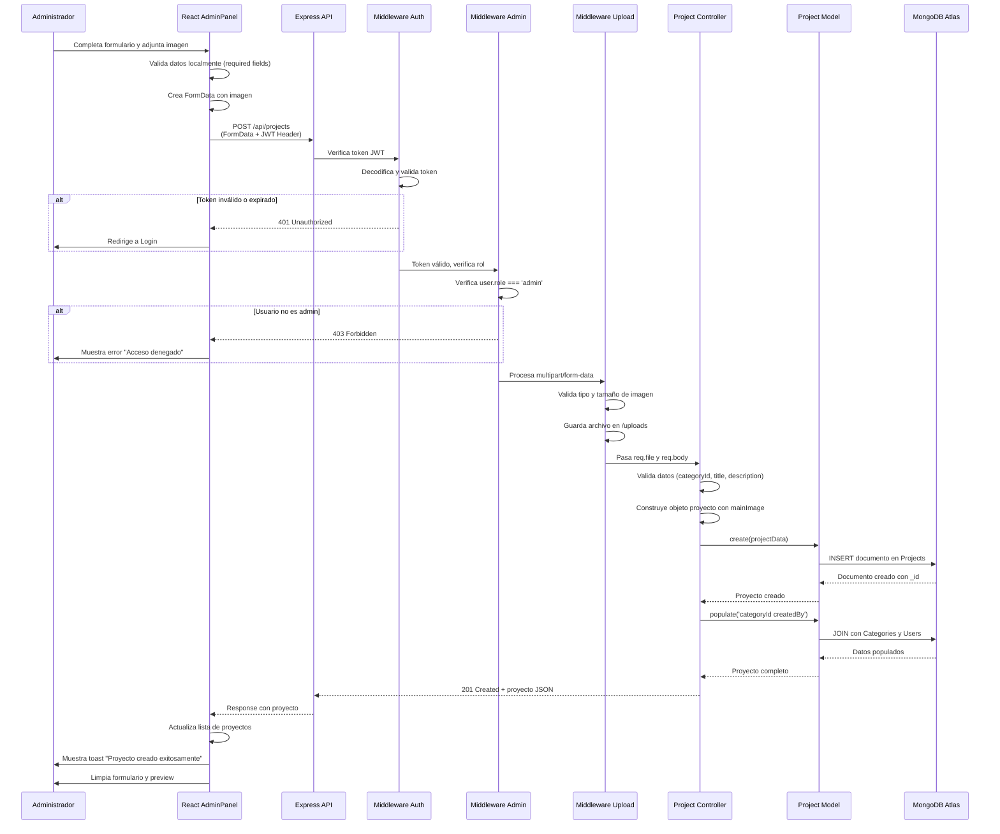
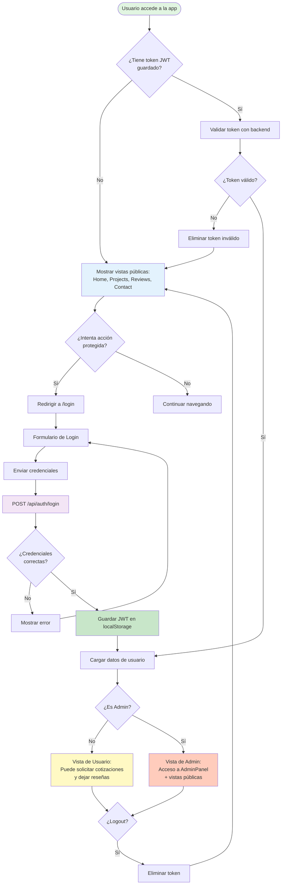
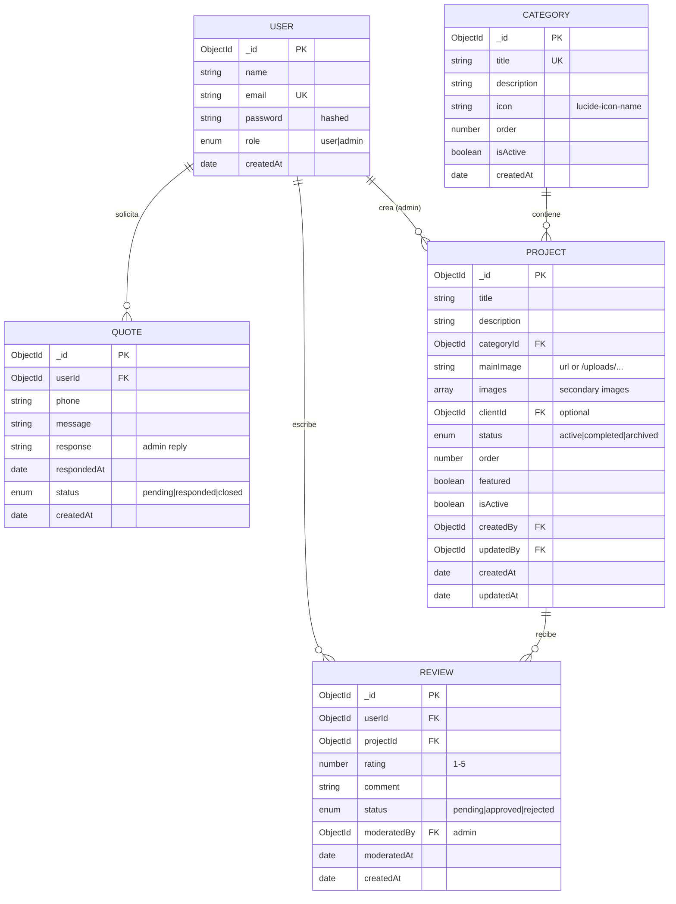

# Diagramas del Sistema ISIELECT

Este documento contiene los diagramas técnicos que describen la arquitectura, flujos de interacción y estructura del sistema de gestión de proyectos y cotizaciones de ISIELECT.

---

## 1. Diagrama de Arquitectura Cliente-Servidor

Este diagrama ilustra la interacción entre las capas frontend, backend y base de datos, incluyendo los flujos de autenticación, capas de middleware y la separación entre rutas públicas y administrativas.



**Ventajas de esta arquitectura:**
- **Escalabilidad**: Separación clara entre capas permite escalar frontend y backend de forma independiente
- **Mantenibilidad**: Responsabilidades bien definidas facilitan depuración y actualizaciones
- **Seguridad**: Middleware de autenticación centralizado protege rutas administrativas
- **Flexibilidad**: API REST permite integrar clientes adicionales (móvil, desktop) en el futuro

---

## 2. Diagrama de Secuencia: Creación de Proyecto

Este diagrama describe paso a paso la interacción que ocurre cuando un administrador crea un nuevo proyecto en el sistema.



**Puntos clave de validación:**
1. **Autenticación**: Token JWT válido y no expirado
2. **Autorización**: Usuario con rol 'admin'
3. **Validación de archivo**: Imagen dentro de límites (10MB, tipo image/*)
4. **Validación de datos**: categoryId existe, campos requeridos presentes
5. **Respuesta poblada**: Incluye datos relacionados (categoría, autor) para el UI

---

## 3. Diagrama de Endpoints API

Este diagrama mapea todas las rutas HTTP, métodos, datos esperados y respuestas generadas por cada endpoint.

```mermaid
---
config:
  theme: default
  layout: elk
---
graph TD
    subgraph Auth["🔐 Authentication Endpoints"]
        AUTH1["POST /api/auth/register<br/>📝 Body: name, email, password<br/>✅ Response: user + token"]
        AUTH2["POST /api/auth/login<br/>📝 Body: email, password<br/>✅ Response: user + token"]
        AUTH3["GET /api/auth/me<br/>🔑 Headers: JWT<br/>✅ Response: user data"]
    end

    subgraph Proj["📁 Projects Endpoints"]
        PROJ1["GET /api/projects<br/>❓ Query: categoryId?<br/>✅ Response: projects array"]
        PROJ2["GET /api/projects/:id<br/>✅ Response: project detail"]
        PROJ3["POST /api/projects<br/>🔒 Auth: Admin<br/>📝 Body: FormData + image<br/>✅ Response: created project"]
        PROJ4["PUT /api/projects/:id<br/>🔒 Auth: Admin<br/>📝 Body: FormData + image?<br/>✅ Response: updated project"]
        PROJ5["DELETE /api/projects/:id<br/>🔒 Auth: Admin<br/>✅ Response: success message"]
        PROJ6["PATCH /api/projects/:id/deactivate<br/>🔒 Auth: Admin<br/>✅ Response: deactivated project"]
    end

    subgraph Cat["📂 Categories Endpoints"]
        CAT1["GET /api/categories<br/>✅ Response: categories array"]
        CAT2["POST /api/categories<br/>🔒 Auth: Admin<br/>📝 Body: title, description, icon, order<br/>✅ Response: created category"]
        CAT3["PUT /api/categories/:id<br/>🔒 Auth: Admin<br/>📝 Body: title, description, icon, order<br/>✅ Response: updated category"]
        CAT4["DELETE /api/categories/:id<br/>🔒 Auth: Admin<br/>✅ Response: success message"]
        CAT5["PATCH /api/categories/:id/deactivate<br/>🔒 Auth: Admin<br/>✅ Response: deactivated category"]
    end

    subgraph Quotes["💬 Quotes Endpoints"]
        QUOTE1["GET /api/quotes<br/>🔒 Auth: Admin<br/>✅ Response: all quotes array"]
        QUOTE2["POST /api/quotes<br/>👤 Auth: User<br/>📝 Body: phone, message<br/>✅ Response: created quote"]
        QUOTE3["PATCH /api/quotes/:id/reply<br/>🔒 Auth: Admin<br/>📝 Body: response<br/>✅ Response: updated quote"]
        QUOTE4["DELETE /api/quotes/:id<br/>🔒 Auth: Admin<br/>✅ Response: success message"]
    end

    subgraph Rev["⭐ Reviews Endpoints"]
        REV1["GET /api/reviews<br/>❓ Query: status=approved<br/>✅ Response: reviews array"]
        REV2["GET /api/reviews/pending<br/>🔒 Auth: Admin<br/>✅ Response: pending reviews"]
        REV3["POST /api/reviews<br/>👤 Auth: User<br/>📝 Body: projectId, rating, comment<br/>✅ Response: created review"]
        REV4["PATCH /api/reviews/:id/approve<br/>🔒 Auth: Admin<br/>✅ Response: approved review"]
        REV5["PATCH /api/reviews/:id/reject<br/>🔒 Auth: Admin<br/>✅ Response: rejected review"]
        REV6["DELETE /api/reviews/:id<br/>🔒 Auth: Admin<br/>✅ Response: success message"]
    end

    style AUTH1 fill:#e3f2fd,stroke:#1976d2,stroke-width:2px
    style AUTH2 fill:#e3f2fd,stroke:#1976d2,stroke-width:2px
    style AUTH3 fill:#e3f2fd,stroke:#1976d2,stroke-width:2px
    style PROJ1 fill:#e8f5e9,stroke:#388e3c,stroke-width:2px
    style PROJ2 fill:#e8f5e9,stroke:#388e3c,stroke-width:2px
    style PROJ3 fill:#ffebee,stroke:#d32f2f,stroke-width:2px
    style PROJ4 fill:#ffebee,stroke:#d32f2f,stroke-width:2px
    style PROJ5 fill:#ffebee,stroke:#d32f2f,stroke-width:2px
    style PROJ6 fill:#ffebee,stroke:#d32f2f,stroke-width:2px
    style CAT1 fill:#e8f5e9,stroke:#388e3c,stroke-width:2px
    style CAT2 fill:#ffebee,stroke:#d32f2f,stroke-width:2px
    style CAT3 fill:#ffebee,stroke:#d32f2f,stroke-width:2px
    style CAT4 fill:#ffebee,stroke:#d32f2f,stroke-width:2px
    style CAT5 fill:#ffebee,stroke:#d32f2f,stroke-width:2px
    style QUOTE1 fill:#ffebee,stroke:#d32f2f,stroke-width:2px
    style QUOTE2 fill:#fff3e0,stroke:#f57c00,stroke-width:2px
    style QUOTE3 fill:#ffebee,stroke:#d32f2f,stroke-width:2px
    style QUOTE4 fill:#ffebee,stroke:#d32f2f,stroke-width:2px
    style REV1 fill:#e8f5e9,stroke:#388e3c,stroke-width:2px
    style REV2 fill:#ffebee,stroke:#d32f2f,stroke-width:2px
    style REV3 fill:#fff3e0,stroke:#f57c00,stroke-width:2px
    style REV4 fill:#ffebee,stroke:#d32f2f,stroke-width:2px
    style REV5 fill:#ffebee,stroke:#d32f2f,stroke-width:2px
    style REV6 fill:#ffebee,stroke:#d32f2f,stroke-width:2px
```



**Leyenda:**
- 🔵 **Azul**: Endpoints de autenticación
- 🟢 **Verde (sin color)**: Endpoints públicos GET
- 🔴 **Rojo**: Endpoints que requieren autenticación Admin

**Convenciones:**
- Todos los endpoints admin requieren header `Authorization: Bearer <token>`
- Los endpoints POST/PUT/PATCH esperan `Content-Type: application/json` o `multipart/form-data` (proyectos)
- Los errores siguen formato: `{ success: false, message: "..." }`
- Las respuestas exitosas siguen: `{ success: true, data: {...} }`

---

## 4. Wireframes y Mockups de Interfaces

### 4.1 Admin Panel - Pestaña de Proyectos

```
┌─────────────────────────────────────────────────────────────────┐
│  ISIELECT - Panel de Administración                    [Logout] │
├─────────────────────────────────────────────────────────────────┤
│  [Proyectos] [Cotizaciones] [Reseñas] [Categorías]             │
├─────────────────────────────────────────────────────────────────┤
│                                                                  │
│  Crear Nuevo Proyecto                                           │
│  ┌────────────────────────────────────────────────────────────┐│
│  │ Título*         [________________________]                  ││
│  │                                                              ││
│  │ Descripción*    [________________________]                  ││
│  │                 [________________________]                  ││
│  │                 [________________________]                  ││
│  │                                                              ││
│  │ Categoría*      [▼ Seleccionar categoría]                  ││
│  │                                                              ││
│  │ Imagen:         [ URL de imagen        ]                    ││
│  │           o     [ Subir archivo ▼ ]                         ││
│  │                                                              ││
│  │ Preview:        ┌──────────┐                                ││
│  │                 │  [IMG]   │                                ││
│  │                 └──────────┘                                ││
│  │                                                              ││
│  │                      [  Crear Proyecto  ]                   ││
│  └────────────────────────────────────────────────────────────┘│
│                                                                  │
│  Proyectos Existentes                                           │
│  ┌────────────────────────────────────────────────────────────┐│
│  │ [IMG] │ Proyecto Industrial CFE        │ Industrial    │ ✏️ 🗑️││
│  │ [IMG] │ Instalación Comercial Plaza    │ Comercial     │ ✏️ 🗑️││
│  │ [IMG] │ Casa Residencial Col. Centro   │ Residencial   │ ✏️ 🗑️││
│  └────────────────────────────────────────────────────────────┘│
└─────────────────────────────────────────────────────────────────┘
```

### 4.2 Página Pública de Proyectos

```
┌─────────────────────────────────────────────────────────────────┐
│  [LOGO] ISIELECT      [Inicio] [Proyectos] [Reseñas] [Contacto]│
├─────────────────────────────────────────────────────────────────┤
│                                                                  │
│         Nuestros Proyectos                                      │
│         Conoce algunos de nuestros trabajos más destacados      │
│                                                                  │
├─────────────────────────────────────────────────────────────────┤
│  Filtrar por categoría:                                         │
│  [ 🏭 Todos ]  [ ⚡ Industrial ]  [ 🏢 Comercial ]  [ 🏠 Residencial ]│
├─────────────────────────────────────────────────────────────────┤
│                                                                  │
│  ┌────────────┐  ┌────────────┐  ┌────────────┐               │
│  │   [IMG]    │  │   [IMG]    │  │   [IMG]    │               │
│  │            │  │            │  │            │               │
│  │ Proyecto 1 │  │ Proyecto 2 │  │ Proyecto 3 │               │
│  │ Industrial │  │ Comercial  │  │ Residencial│               │
│  │            │  │            │  │            │               │
│  │ Desc...    │  │ Desc...    │  │ Desc...    │               │
│  └────────────┘  └────────────┘  └────────────┘               │
│                                                                  │
│  ┌────────────┐  ┌────────────┐  ┌────────────┐               │
│  │   [IMG]    │  │   [IMG]    │  │   [IMG]    │               │
│  │            │  │            │  │            │               │
│  │ Proyecto 4 │  │ Proyecto 5 │  │ Proyecto 6 │               │
│  │ Industrial │  │ Comercial  │  │ Industrial │               │
│  │            │  │            │  │            │               │
│  │ Desc...    │  │ Desc...    │  │ Desc...    │               │
│  └────────────┘  └────────────┘  └────────────┘               │
│                                                                  │
└─────────────────────────────────────────────────────────────────┘
```

### 4.3 Interfaz de Envío de Reseña

```
┌─────────────────────────────────────────────────────────────────┐
│                    Dejar una Reseña                             │
├─────────────────────────────────────────────────────────────────┤
│                                                                  │
│  Proyecto:      [▼ Seleccionar proyecto realizado]             │
│                                                                  │
│  Calificación:  ★ ★ ★ ★ ★                                      │
│                 (Haz clic para calificar)                       │
│                                                                  │
│  Tu Comentario: [_________________________________]             │
│                 [_________________________________]             │
│                 [_________________________________]             │
│                 [_________________________________]             │
│                                                                  │
│  Nota: Tu reseña será revisada por nuestro equipo antes        │
│        de ser publicada.                                        │
│                                                                  │
│                      [  Enviar Reseña  ]                        │
│                                                                  │
└─────────────────────────────────────────────────────────────────┘
```

### 4.4 Panel de Moderación de Reseñas

```
┌─────────────────────────────────────────────────────────────────┐
│  ISIELECT - Panel de Administración                             │
├─────────────────────────────────────────────────────────────────┤
│  [Proyectos] [Cotizaciones] [Reseñas] [Categorías]             │
├─────────────────────────────────────────────────────────────────┤
│                                                                  │
│  Reseñas Pendientes de Moderación                               │
│                                                                  │
│  ┌────────────────────────────────────────────────────────────┐│
│  │ 👤 Juan Pérez                    Fecha: 15/11/2025         ││
│  │ Proyecto: Instalación Industrial CFE                       ││
│  │ Calificación: ★★★★★                                        ││
│  │                                                             ││
│  │ "Excelente trabajo, muy profesionales. Cumplieron con      ││
│  │  todos los tiempos acordados y la instalación quedó        ││
│  │  perfecta. Totalmente recomendados."                       ││
│  │                                                             ││
│  │              [ ✅ Aprobar ]    [ ❌ Rechazar ]              ││
│  └────────────────────────────────────────────────────────────┘│
│                                                                  │
│  ┌────────────────────────────────────────────────────────────┐│
│  │ 👤 María González                Fecha: 14/11/2025         ││
│  │ Proyecto: Casa Residencial Centro                          ││
│  │ Calificación: ★★★★☆                                        ││
│  │                                                             ││
│  │ "Buen servicio en general. La única observación es que     ││
│  │  tardaron un día más de lo previsto, pero el resultado     ││
│  │  final es muy bueno."                                      ││
│  │                                                             ││
│  │              [ ✅ Aprobar ]    [ ❌ Rechazar ]              ││
│  └────────────────────────────────────────────────────────────┘│
│                                                                  │
└─────────────────────────────────────────────────────────────────┘
```

---

## 5. Diagrama de Flujo de Autenticación



---

## 6. Diagrama de Componentes React

```mermaid
graph TD
    App[App.tsx<br/>Router Principal] --> Nav[Navigation.tsx<br/>Header + Menu]
    App --> AuthContext[AuthContext.tsx<br/>Estado Global Auth]
    
    App --> Home[HomePage.tsx]
    App --> Projects[ProjectsPage.tsx]
    App --> Reviews[ReviewsPage.tsx]
    App --> Contact[ContactPage.tsx]
    App --> About[AboutPage.tsx]
    App --> Login[LoginPage.tsx]
    App --> Profile[ProfilePage.tsx]
    App --> Admin[AdminPanel.tsx]
    
    Projects --> API1[categoriesAPI.getAll]
    Projects --> API2[projectsAPI.getAll]
    
    Admin --> AdminProjects[Projects Tab]
    Admin --> AdminQuotes[Quotes Tab]
    Admin --> AdminReviews[Reviews Tab]
    Admin --> AdminCategories[Categories Tab]
    
    AdminProjects --> API3[projectsAPI.create/update]
    AdminQuotes --> API4[quotesAPI.reply/delete]
    AdminReviews --> API5[reviewsAPI.approve/reject]
    AdminCategories --> API6[categoriesAPI.create/update]
    
    Contact --> API7[quotesAPI.create]
    Reviews --> API8[reviewsAPI.create]
    
    AuthContext --> API9[authAPI.login/register/me]
    
    Nav --> UserMenu[UserMenu.tsx<br/>Dropdown User]
    
    App --> Footer[Footer.tsx]
    
    style App fill:#61dafb,stroke:#333,stroke-width:3px
    style AuthContext fill:#ffd700,stroke:#333,stroke-width:2px
    style Admin fill:#ff6b6b,stroke:#333,stroke-width:2px
    style API1 fill:#4caf50
    style API2 fill:#4caf50
    style API3 fill:#4caf50
    style API4 fill:#4caf50
    style API5 fill:#4caf50
    style API6 fill:#4caf50
    style API7 fill:#4caf50
    style API8 fill:#4caf50
    style API9 fill:#4caf50
```



---

## 7. Diagrama de Modelo de Datos (MongoDB)



**Relaciones clave:**
- Un **User** puede tener múltiples **Quotes**, **Reviews**, y crear **Projects** (si es admin)
- Una **Category** puede contener múltiples **Projects**
- Un **Project** puede recibir múltiples **Reviews**
- Los campos `createdBy`, `updatedBy`, `moderatedBy` referencian al modelo **User**
- Todos los modelos usan `ObjectId` de MongoDB como clave primaria

---

## Notas de Implementación

### Tecnologías Utilizadas
- **Frontend**: React 18 + TypeScript + Vite + Tailwind CSS + shadcn/ui
- **Backend**: Node.js + Express + Mongoose
- **Base de Datos**: MongoDB Atlas
- **Autenticación**: JWT (jsonwebtoken + bcryptjs)
- **Uploads**: Multer (almacenamiento en disco local)
- **Validación**: express-validator
- **CORS**: cors middleware

### Decisiones de Diseño
1. **SPA con React**: Permite navegación fluida sin recargas de página
2. **API RESTful**: Estándar de la industria, fácil de documentar y consumir
3. **JWT sin refresh tokens**: Implementación simplificada para MVP
4. **Soft delete**: Los proyectos y categorías se desactivan en lugar de eliminarse
5. **Moderación de reseñas**: Control de calidad antes de publicación
6. **Roles binarios**: user/admin (suficiente para alcance actual)

### Próximos Pasos Recomendados
- [ ] Implementar paginación en listados de proyectos y reseñas
- [ ] Agregar búsqueda full-text en proyectos
- [ ] Migrar uploads a Cloudinary para producción
- [ ] Implementar refresh tokens para sesiones más seguras
- [ ] Agregar analytics de proyectos más visitados
- [ ] Exportar cotizaciones a Excel/PDF para reportes

---

**Documento generado el**: 17 de noviembre de 2025  
**Versión del sistema**: 1.0.0  
**Autor**: Proyecto ISIELECT - Ingeniería en Sistemas Computacionales
